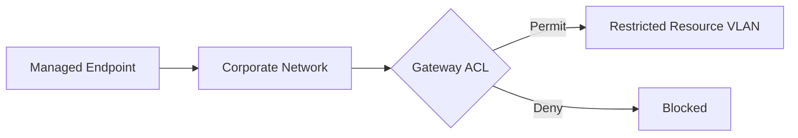

# Access Control

## Problem

Some network resources are appropriate for broad office access, while others should be reachable only from a defined set of managed endpoints.

The goal was to restrict a protected resource without requiring authorized employees to disconnect from their normal corporate network and join a separate SSID.

## Design

The protected resource is placed in a dedicated VLAN. Authorized employee endpoints remain on the normal corporate network. The gateway evaluates inter-VLAN traffic using ordered ACL rules.



## Policy groups

Two logical IP groups are used.

### Restricted Resource

Represents the protected endpoint as one exact host.

Illustrative example:

```text
RESTRICTED-RESOURCE
192.0.2.101/32
```

`/32` represents a single IPv4 host.

### Authorized Endpoints

Contains only managed devices that should be permitted to reach the protected resource.

Illustrative example:

```text
AUTHORIZED-ENDPOINTS
198.51.100.10/32
198.51.100.11/32
198.51.100.12/32
```

These addresses are documentation examples only and are not production values.

## ACL order

### Rule 1 — Permit authorized endpoints

```text
Direction:       LAN → LAN
Policy:          Permit
Protocol:        All
Source:          AUTHORIZED-ENDPOINTS
Destination:     RESTRICTED-RESOURCE
```

### Rule 2 — Deny everyone else

```text
Direction:       LAN → LAN
Policy:          Deny
Protocol:        All
Source:          Any
Destination:     RESTRICTED-RESOURCE
```

The permit rule must remain above the deny rule.

## Result

| Traffic | Outcome |
|---|---|
| Authorized managed endpoint → protected resource | Allowed |
| Other endpoint → protected resource | Denied |
| Employee internet access | Unaffected |
| General office resources | Unaffected unless separately controlled |

## Why this model was chosen

Authorized employees remain on the normal corporate network, retain normal internet connectivity, and gain access only to the protected resource they are approved to use.

The protected resource remains isolated from the rest of the office by default.

## Managed-device workflow

1. Identify the endpoint's active network adapter.
2. Match its MAC address with the controller client record.
3. Assign a descriptive managed-device identity.
4. Create a DHCP reservation when stable addressing is required.
5. Add the reserved address to the authorized endpoint group.
6. Verify that the endpoint can reach the protected resource.
7. Verify that a non-authorized endpoint cannot reach it.

## Operational maintenance

Authorization should be reviewed when an employee changes device, a workstation is replaced, a role or department changes, a device is retired, or access is no longer required.

This prevents stale reservations from becoming unintended long-term permissions.
