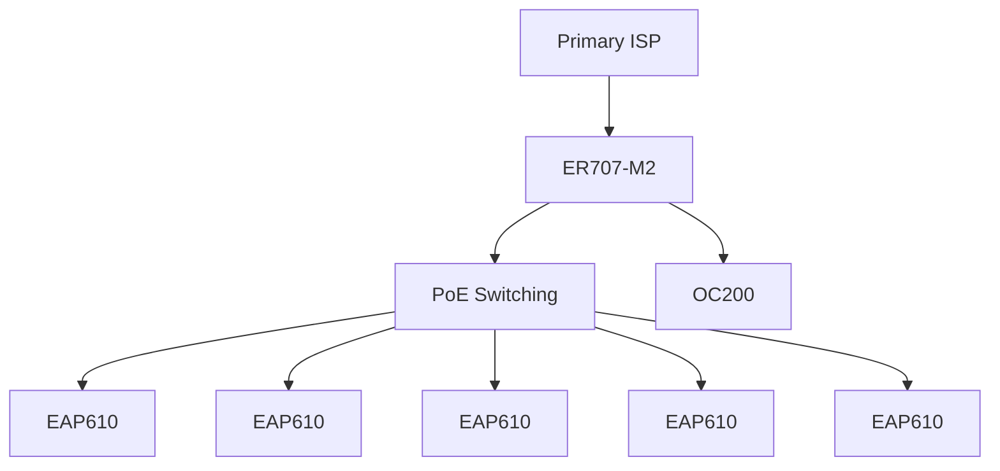

# Network Design

## Objective

The network was designed to support a growing office environment with centralized administration, multiple wireless access points, managed endpoints, and resources with different access requirements.

The design supports both normal office connectivity and restricted resources that should be reachable only from explicitly authorized endpoints.

## Core components

| Role | Platform |
|---|---|
| Gateway / routing | TP-Link ER707-M2 |
| Hardware controller | TP-Link OC200 |
| Wireless access | 5 × TP-Link EAP610 |
| Management platform | Omada SDN |

The access-point fleet contains both V3 and V4 hardware revisions. Mixed revisions are supported, but firmware must be managed according to the correct hardware track.

## Physical topology

Wired backhaul is preferred for all access points. Wireless uplink remains a recovery mechanism rather than the intended steady-state design.

## Logical network model

The production network contains a standard office network plus a separate segment for restricted resources. For this public documentation, all identifiers and addressing are illustrative.

| Segment | Purpose |
|---|---|
| Corporate Network | Employee devices and normal office access |
| General Resource Network | Unrestricted printers and similar shared devices |
| Restricted Resource VLAN | Resources that require explicit authorization |

The general resource network can remain part of the standard office LAN when no access restriction is required. The restricted-resource VLAN is carried only where needed and is protected through gateway ACLs.

## Wireless architecture

General employee wireless service supports both 2.4 GHz and 5 GHz.

Operational design includes:

- 5 GHz preference for capable devices
- Fast roaming
- Controller-assisted roaming behavior
- RSSI-based tuning
- Per-client traffic shaping
- Centralized monitoring
- Multicast optimization where required

Resource-specific wireless connectivity can be mapped to the restricted VLAN without requiring authorized employee endpoints themselves to join that SSID.

## Address management

Normal clients use DHCP. Stable addresses are reserved centrally for infrastructure controllers, protected resources, and managed endpoints participating in IP-based policy.

The client operating system remains configured for automatic DHCP.

## Endpoint identity

Managed endpoints are identified by matching the active network adapter's MAC address with the corresponding client in the controller.

The public documentation intentionally omits the production naming convention and individual device identities.

## WAN design

Only the implemented primary internet path is part of the current architecture.

The gateway supports multi-WAN operation, so a secondary circuit and automatic failover can be introduced later without replacing the routing platform.
